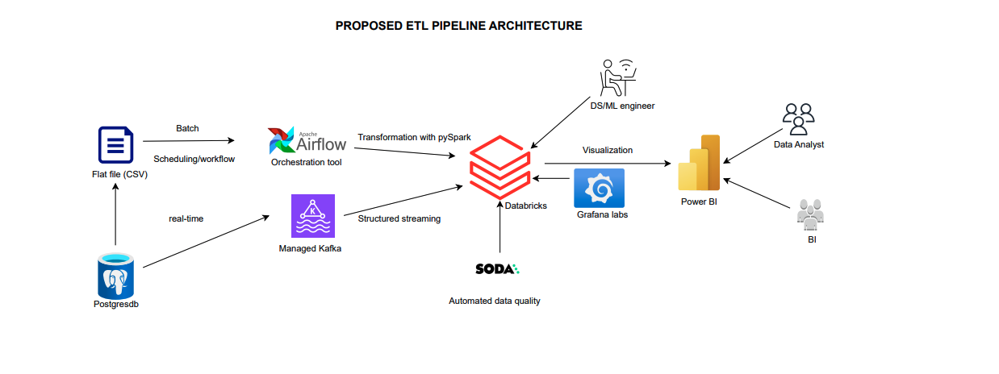
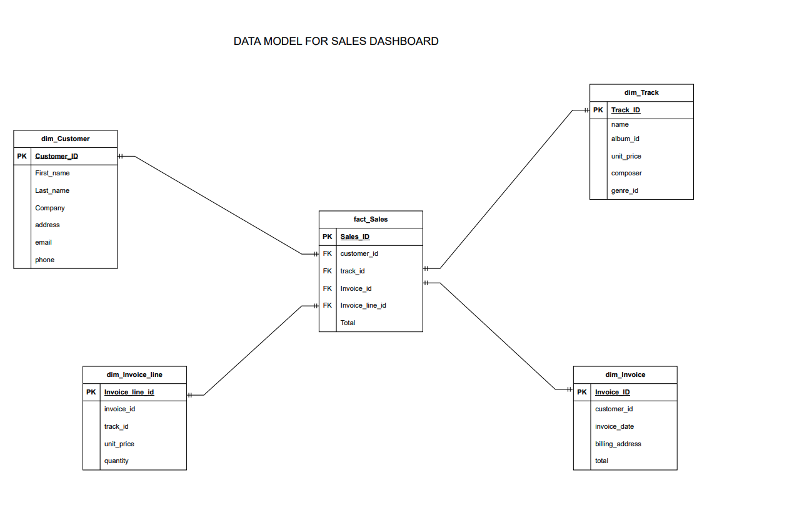

# Digital_media_store_analysis
Use chinook datasets to carry out tasks (ETL) and Data modelling

## Installation

To set up the project locally, follow these steps:

1. Clone the repository:
   ```bash
   git clone https://github.com/Mamiololo01/Digital_media_store_analysis.git
   cd Digital_media_store_analysis
   ```

2. Create a virtual environment and activate it:
   ```bash
   python3 -m venv venv
   source venv/bin/activate
   ```

3. Install the required dependencies:
   ```bash
   pip install -r requirements.txt
   ```

## Technical architecture

Below is the proposed ETL pipeline architecture for both batching and real-time streaming



Extraction – ingest CSV for batch processing using Apache Airflow as orchestration tool to schedule the ingestion and monitor the workflow. Additionally due to the management overload of using Apache Kafka, Zookeeper, brokers, topic, consumer groups etc, managed MSK will avoid the management overhead for real time traffic.


Transformation – At this stage, both traffic is on Databricks and the required aggregation and computation will be implemented using PySpark for batch and structured streaming for real-time events. Soda can be integrated to Databricks as quality tool or use the built-in databricks functionality(Delta Lake constraints or custome script)

Loading – The cleaned data can be used on the same databricks or load to another warehouse for analytics.


Monitoring & Error Handling – In the above architecture, Granafa labs for monitoring and alerts. Databrick also has the facility to monitor the jobs and workflow.

Visualization - Power BI integrated to databricks for the business and intelligience team for data-driven analysis and insight.


## Data model for Sales Dashboard



1. Fact Table (sales):
    * The sales table is the central table in the star schema.
    * It contains measures (e.g., Total) and foreign keys linking to dimension tables.
2. Dimension Tables:
    * customer: Contains customer-related attributes.
    * track: Contains track-related attributes.
    * time: Contains time-related attributes for analysis (e.g., monthly or yearly sales).
3. Relationships:
    * The sales table is connected to the customer, track, and time tables via foreign keys.
    * These relationships enable multidimensional analysis (e.g., sales by customer, sales by track, sales by month/year).
